<!-- $size: 4:3 -->
<!-- page_number: true -->

<center><font size=11 >Machine Learning in </br> Complex Network </font></center>

Xiang Pan    
Supervised By: Hong Huang    
6/2/2019
---

# Complex Network
A **Complex Network** is a graph (network) with non-trivial topological features—features that do not occur in simple networks such as lattices or random graphs but often occur in graphs modelling of real systems.

**Node and Link**:The general model for the world
**CS**?:Compute and Storage


---

## Traditional Method
  - Dynamics
    - Deep Walk
      - Population Predication
    - Propagation Theory
      - Infectious Diseases Propagation
  - Cluster Theory
    - Aggregation
      - Community Dection


---
<small>

# Why ML?
## ML
  - Understood Based on DataSet  
    - DataSet Type  
      - NLP  
      - CV  
    - Algothrim in DataSet  
      - Supervised  
      - Unsuperised  
        - GAN?  
      - Half Supervised  
      - **More**?  
        - Transfer Leaning  
          - Federated Learning    
    - DataSet Representation  
      - Infomation Theory  
      - Embedding  

</small>

---

## ML+Complex Network
- More information than Vector
  - Build and represent do not loss critical information
    - porpertity 
    - structure
  - Adapt to more general dataset type
- More Method
  - **Graph CNN/DNN/VAE/GAN**


--- 

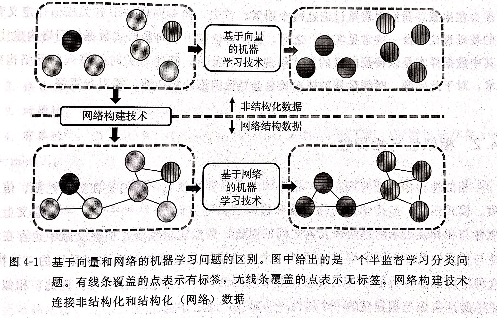  


<!--  -->

--- 


# Pipeline
## ML PipeLine  

```flow
digraph G
{
    "Select Topic"->"Preparing Data Set(Data Clean)"->"Feature Engineering"->"Bilud Model"
}
```

---
## For Network  

```flow
digraph G
{
  "Decide Network Type"->"Data Set"->"Biuld Network"
}
```  

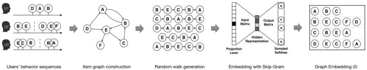

---

# Build Network
## Defination 
### Node
$$N=O(Node)$$
can be the anything of the  world
The understanding 

---

### Link
#### Similarity And Diffidence

$${ V*V \in R  }$$  

$${ S_{ij}=s(v_i,v_j)  }$$  

The **Similarity Function** can be the diastance of  vector representation 
$${ D_{ij}=d(v_i,v_j)  }$$


--- 

The **Diffidence Function** can be calculated by the Similarity Function
$$
{
    d(v_i,v_j)=\sqrt {s(v_i,v_i)+s(v_j,v_j)-2s(v_i,v_j)}
}
$$

$${ P_{ij}=\alpha * S_{ij} + \beta *1/D_{ij}       }$$

Then set a **threshhold** to build the link

---

#### How to determine the threshhold(hyperparameter)?

- Network sparsity(Experience)
>After obtaining the base image matrix and coefficient matrix of non-negative matrix factorization (NMF), Hoyer [1] proposed that the degree of difference between the L1 norm and the L2 norm can be used to measure the sparsity of the matrix after decomposition.
- Training result
  - Auto ML

---
# Network Model Pipeline
- Data
- Network
- Representation
- Target Judge

---
# Representataion
**Network Representation**:Using some method to reduce the dimension of the data, then the network can be represent as a **Vector**
- **Graph Embedding**

---

## MF
M is an **Orthogonal matrix**
### SVD
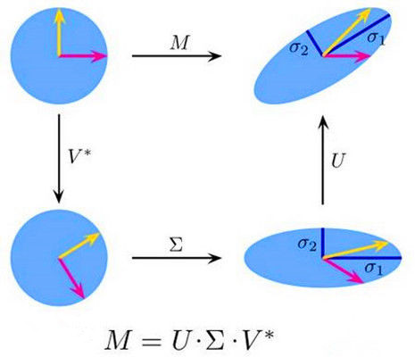


--- 


$$
M \in Space_{node * node}
$$

$U$ is the main Vector representation
$V= \Sigma * V^*$ is the Background Vector Repersentation  


---

## Deep Walk
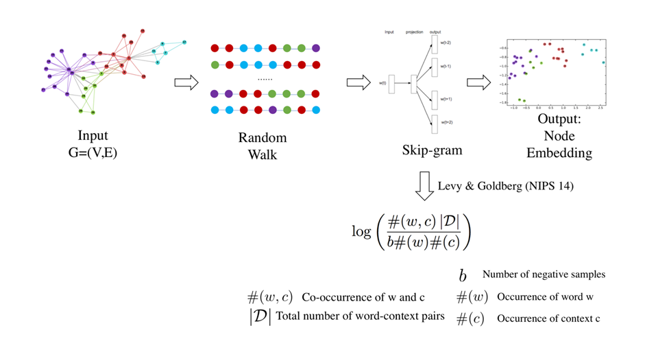


---
### Some tricks in Word2Vec(Deep Walk)
#### Negative Sampling


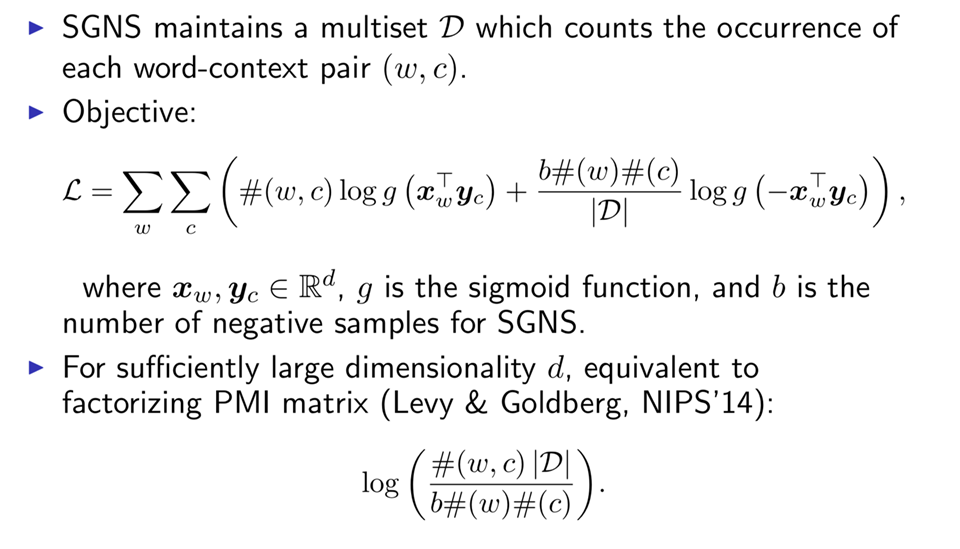

---

#### Hierarchical Huffman Tree


---

### Can be understood by MF?
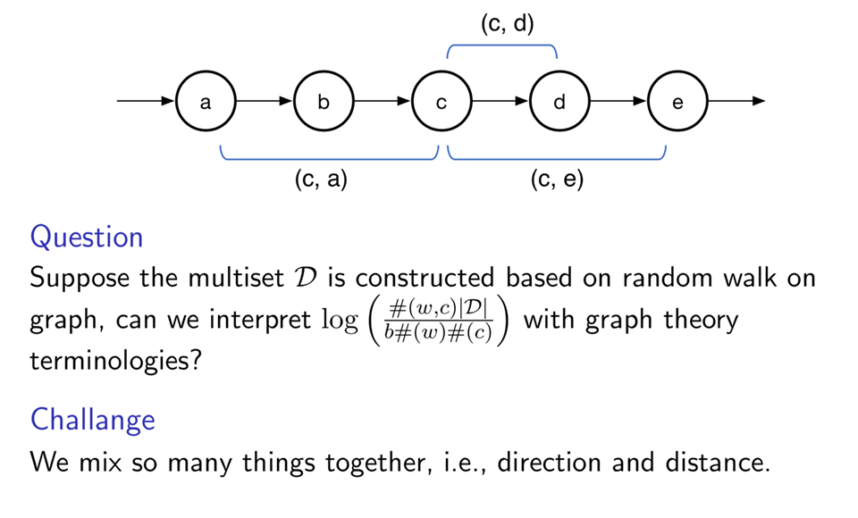

---

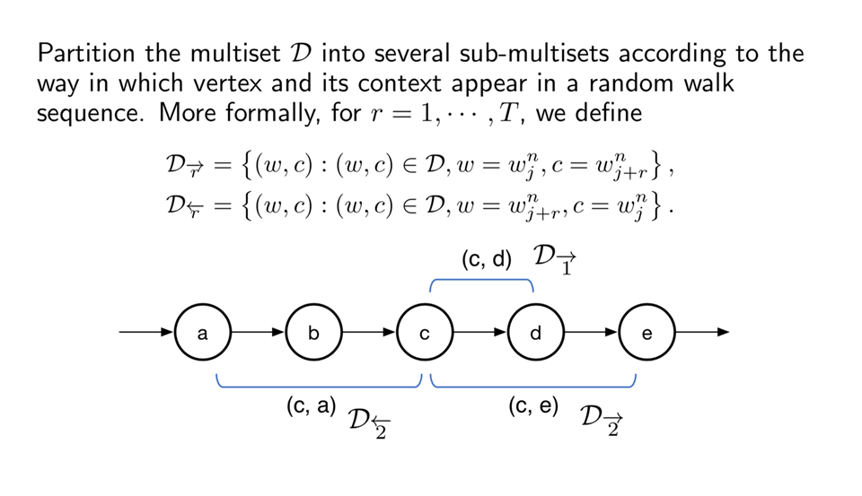


---

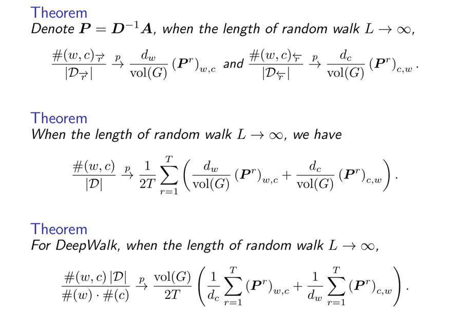

---

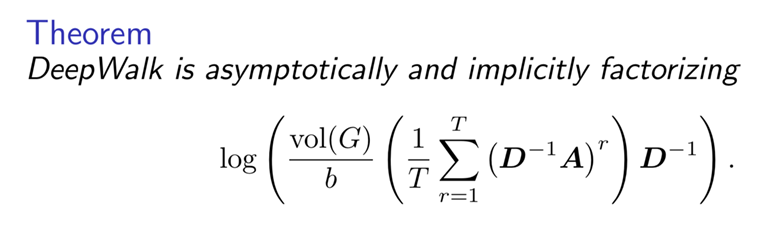


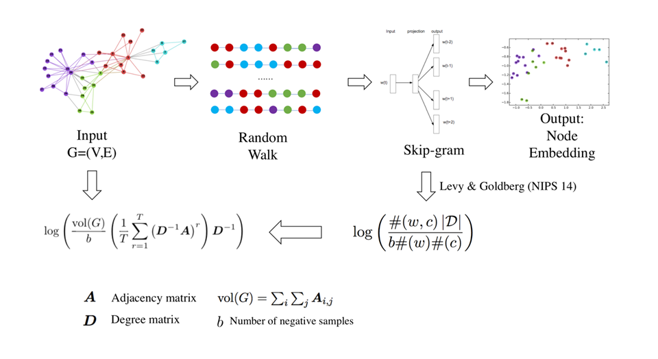


---
## LINE

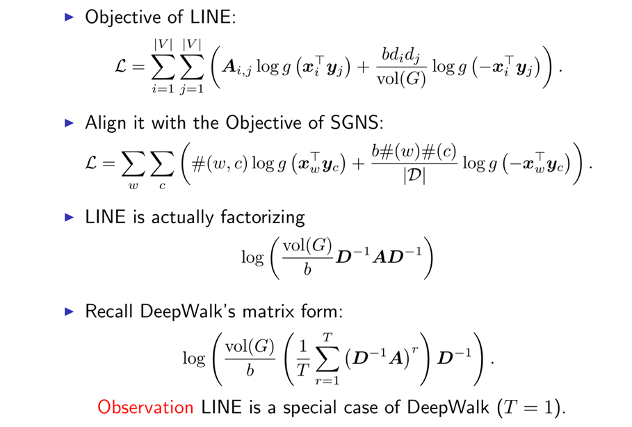


---


## PTE
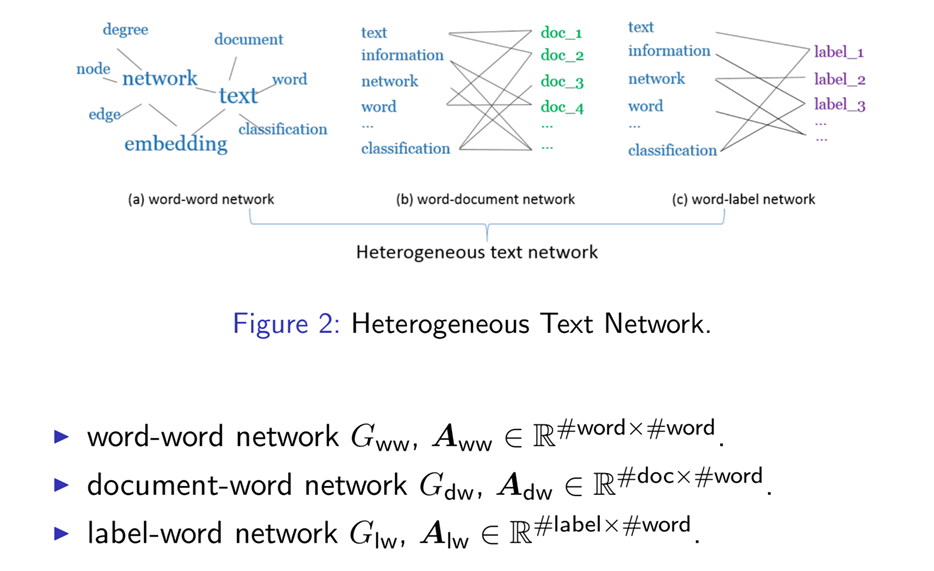

---
### PTE as Implicit Matrix Factorization
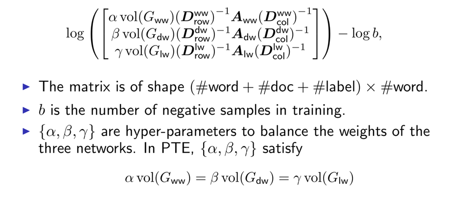

---

## node2vec — 2nd Order Random Walk
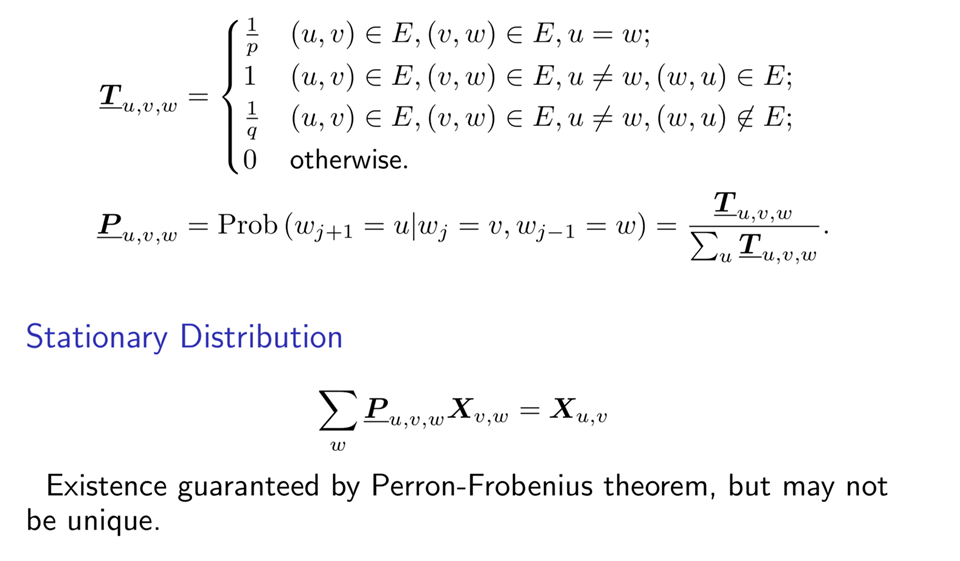

---

### node2vec as Implicit Matrix Factorization

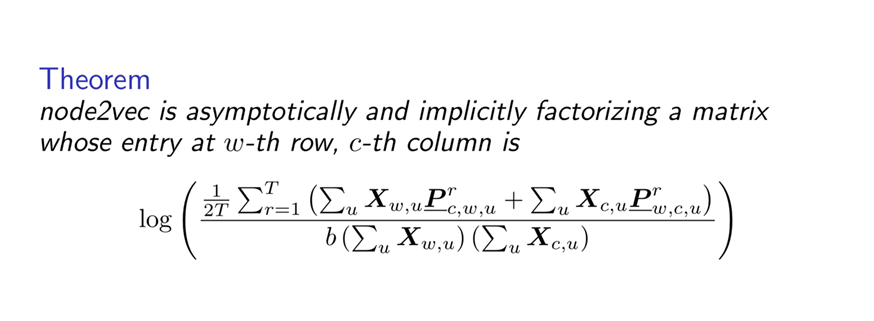


--- 


## Everything is MF
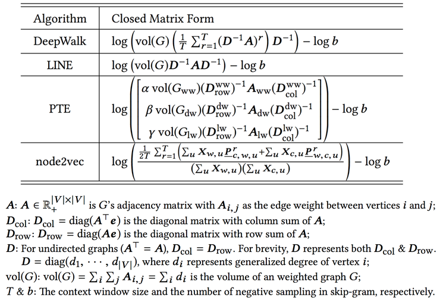


--- 

# NetMF
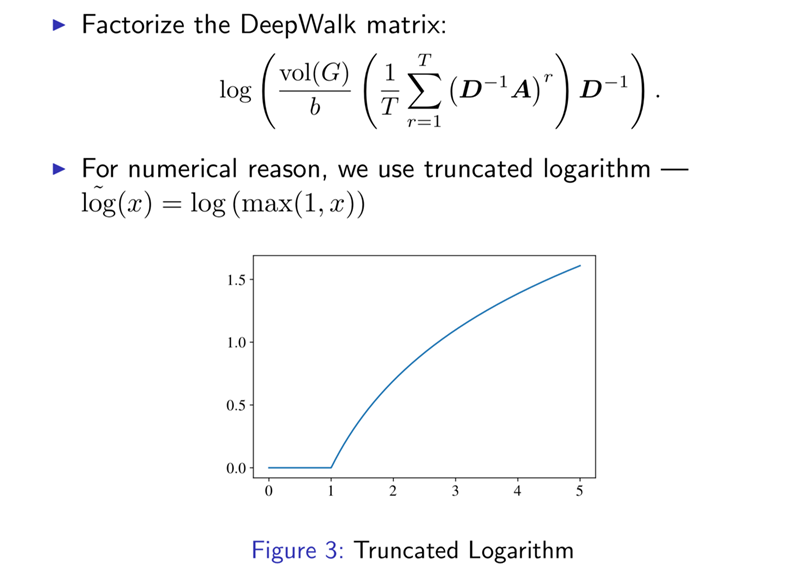


--- 

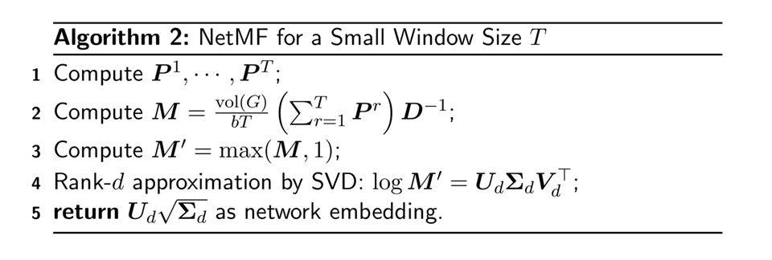

---


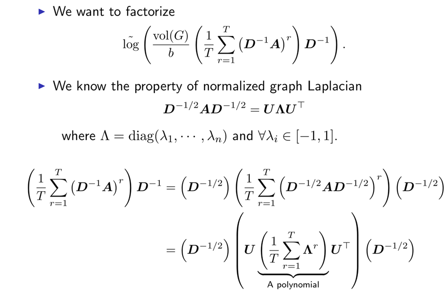


---
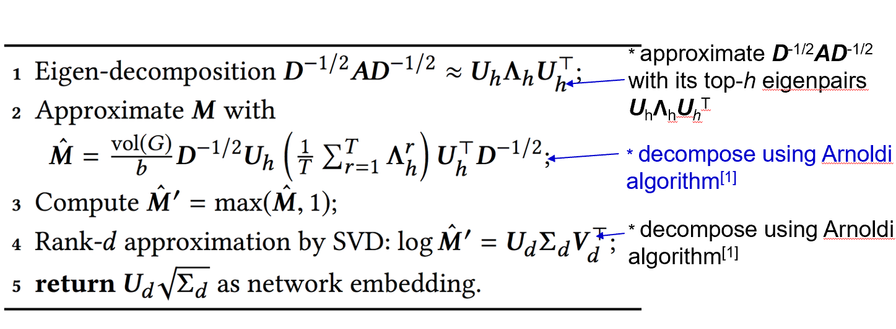


---


# Application
## Abstract
- Link Prediction
- Clustering
- Dynamic Network Analysis

## Real World
- Infectious Diseases
- Academic Network
- Media Web
  - **Recommendation System(RS)**
  - Terrorist Dection  

---


# Recommendation System

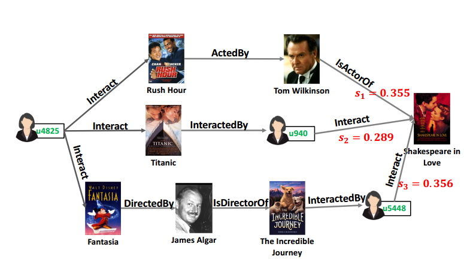

---

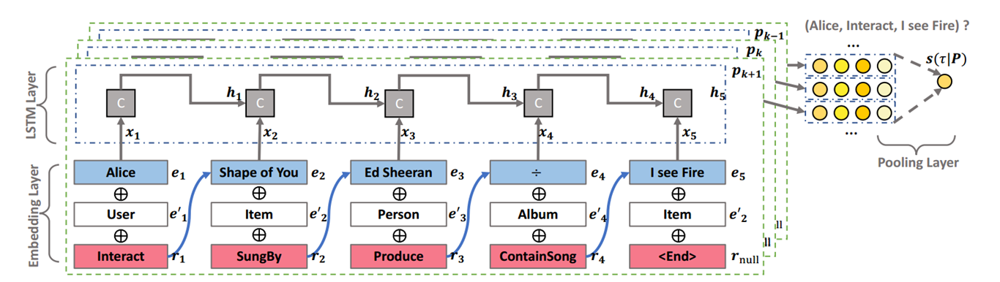

---

# Reference  

- [ Jie Tang's Tutorial in WWW 2019](https://www.aminer.cn/nrl_www2019)
- [Machine Leaning in Complex Network]()


---


