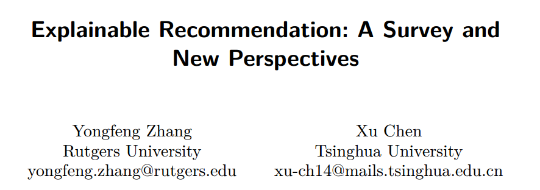

**PanXiang**
							2019.4.9

__Problem__

why such items are recommended

why they not only provideusers with the recommendations

effectiveness

efficiency

persuasiveness

user satisfaction

(how presented)display style:text/visual

(what information used)model:matrix factorization\,topic modeling\, graphbased models\, deep learning\, knowledge\-graph embedding\,  association rule mining

__Time Line__

__CF(Memory\-Based)__

__C__  __ontent\-__  __B__  __ased__  __CF(feature based)__

(price\, color\, brand of the goods in e\-commerce\, or the genre\, director\, duration of the movies inreview systems)

__User\-based CF__  __(user embedding?)__

__Item\-based CF(Item embedding?)__

MF(Model\-Based)

生成式模型/判别式模型?

__MF__

__LFM(Latent Factor Model)__

m user

n  item

A: user\-(item favor value)

U: user\-feature

V: feature\-(itemfavor value)

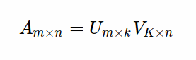

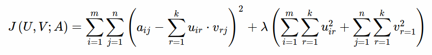

__MF__

__LFM(Latent Factor Model)__  __/Singular Value Decomposition(SVD)?__

m user

n  item

A: user\-(item favor value)

U: user\-feature

V: feature\-(itemfavor value)

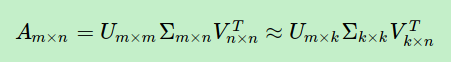

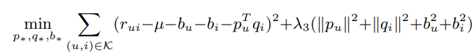

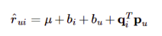

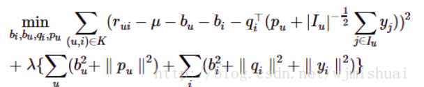

yi反应喜好偏置

I(u)所有交互

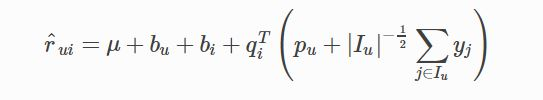

behaviour can reflect favor

2008 KDD Factorization Meets the Neighborhood: a Multifaceted Collaborative Filtering Model

__E__  __FM(Explicit Factor Model)__

\+explicit user opinions

explicit product features

user opinions by phrase\-level sentiment analysis on user reviews

generate according to specific product features to the user’s interests and the hidden features learned

SIGIR 2014Explicit Factor Models for Explainable Recommendation based on Phrase\-level Sentiment Analysis

__EFM(Explicit Factor Model)__

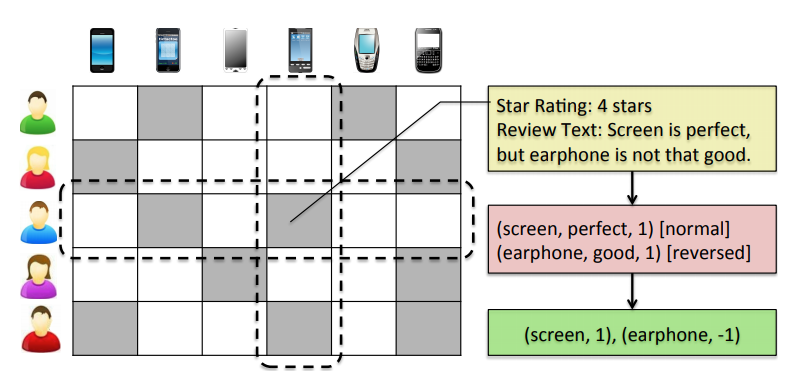

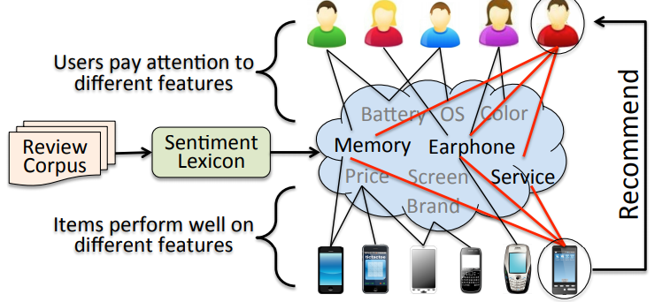

SIGIR 2014Explicit Factor Models for Explainable Recommendation based on Phrase\-level Sentiment Analysis

__EFM(Explicit Factor Model)__

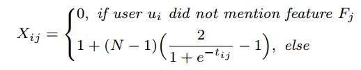

N=5 for five stars

feature Fj is mentioned by user ui for tij times

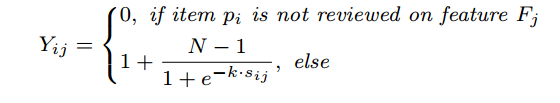

Fj is mentioned for k times on item pi

SIGIR 2014Explicit Factor Models for Explainable Recommendation based on Phrase\-level Sentiment Analysis

__EFM(Explicit Factor Model)__

__Explicit__  __features__

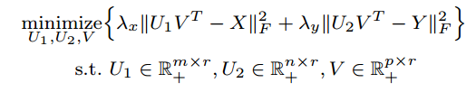

feature: screen/earphone

factor: ???

X:user\-feature attention matrix

Y:item\-feature quality matrix

U1 user\- factor

V    feature\-factor

U2 item\- factor

r factor nums

m user

p feature

n item

SIGIR 2014Explicit Factor Models for Explainable Recommendation based on Phrase\-level Sentiment Analysis

__EFM(Explicit Factor Model)__

__Latent__  __f__  __actors__

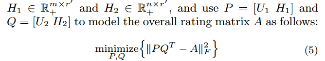

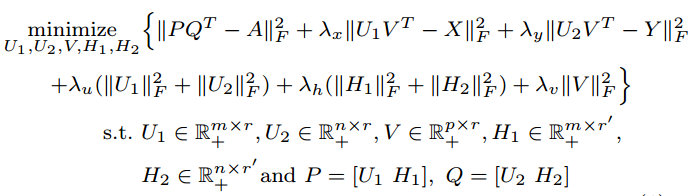

When r = 0\, this model reduces to a traditional latent factorization model on user\-item rating matrix A

which means that the explicit features are not used for recommendations

__EFM(Explicit Factor Model)__  __\+SVD\+\+?__

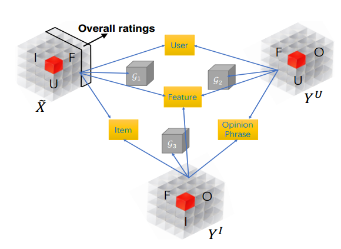

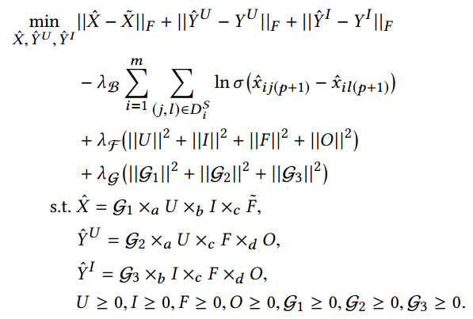

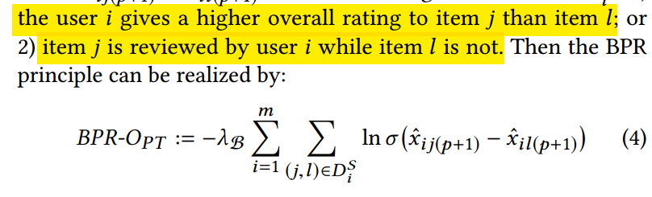

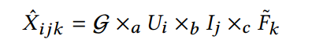

SIGIR’18 Explainable Recommendation via Multi\-Task Learning in Opinionated Text Data

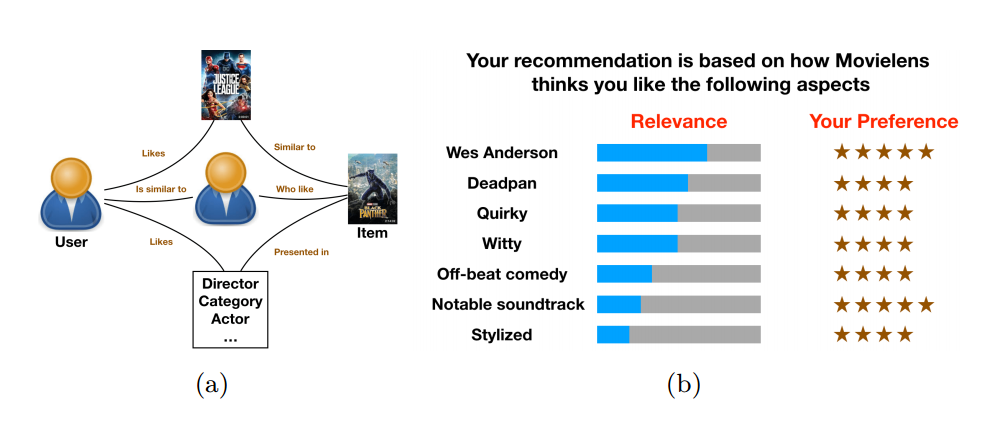

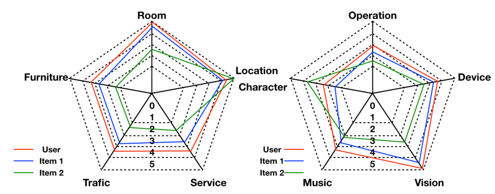

__ConvMF=CNN\+PMF__

__PMF__

R: score Mat

posterior probability

M item

N doc

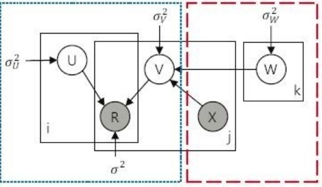

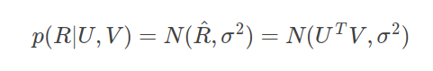

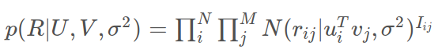

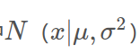

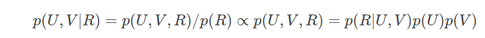

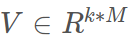

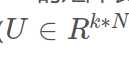

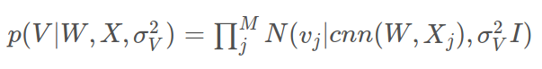

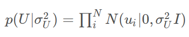

2016Convolutional matrix factorization for document context\-aware recommendation

__CNN:__

__(Music:Fourier\->image\->CNN predict__

__Genetrate Feature)__

Conv \-Classification\->feature extraction

MF    \-Regression

2016Convolutional matrix factorization for document context\-aware recommendation

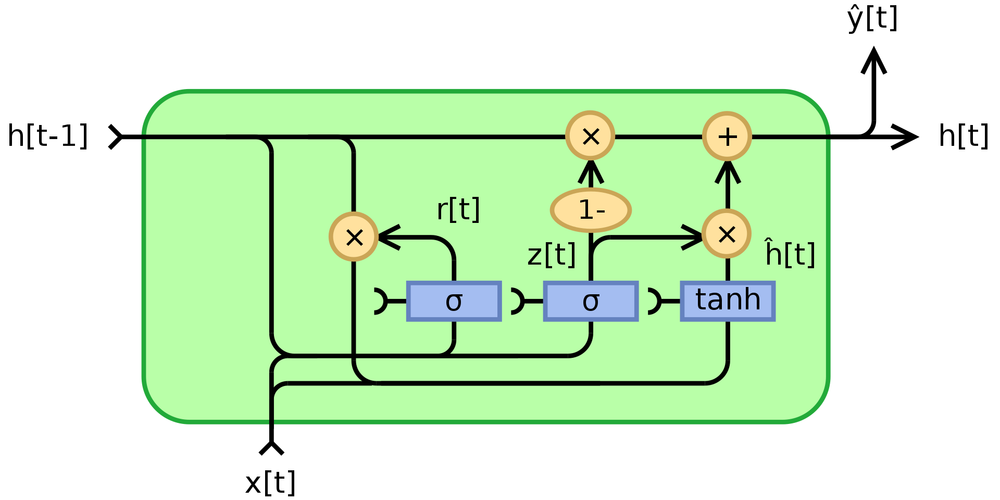

Z\[t\]:update gate vector

R\[t\]:reset gate vector

RecSys17 Sequential User\-based Recurrent Neural Network Recommendations

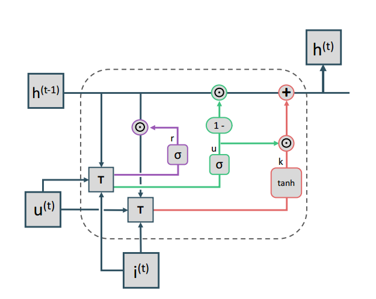

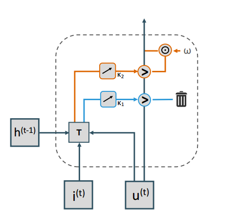

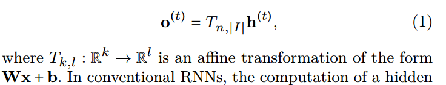

RecSys17 Sequential User\-based Recurrent Neural Network Recommendations

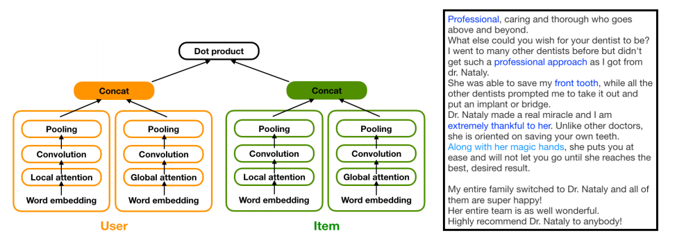

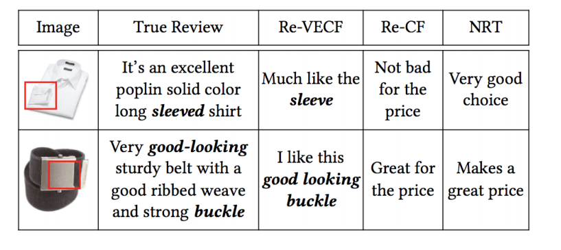

__Text__

__Sentence:__

__Topic words:(features)__

__Visual__

__Friends__

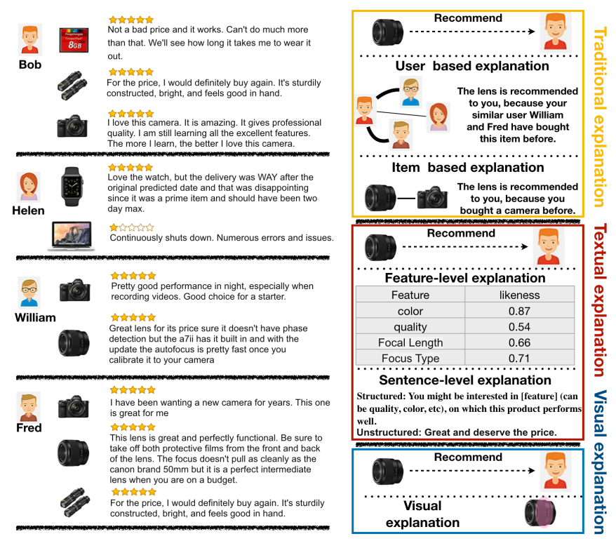

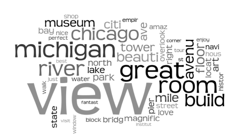

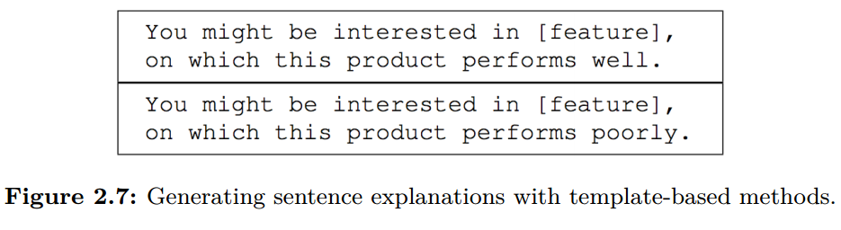

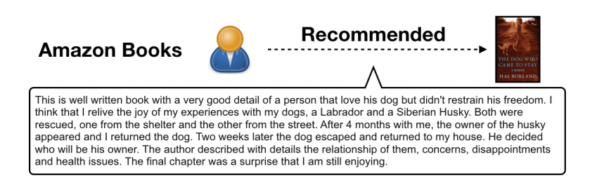

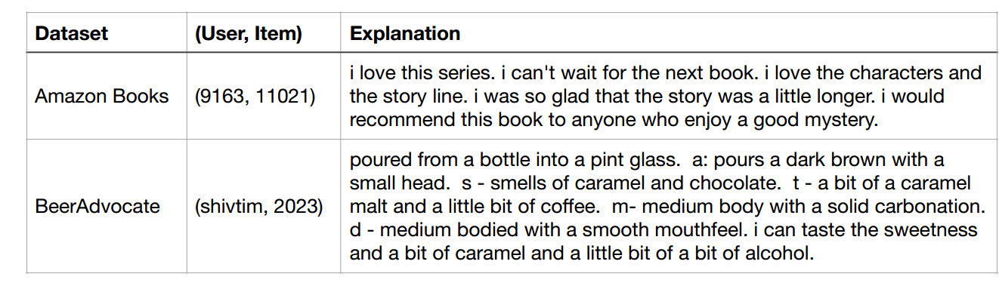

generated character by

character

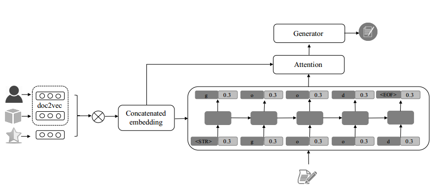

concatenated word

embeddings of user\, item\, and rating

2018Automatic Generation of Natural Language Explanations

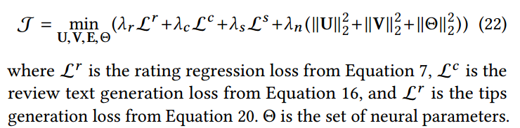

__Text\-based(NLP)__

2018Automatic Generation of Natural Language Explanations

__Text\-based(NLP)__

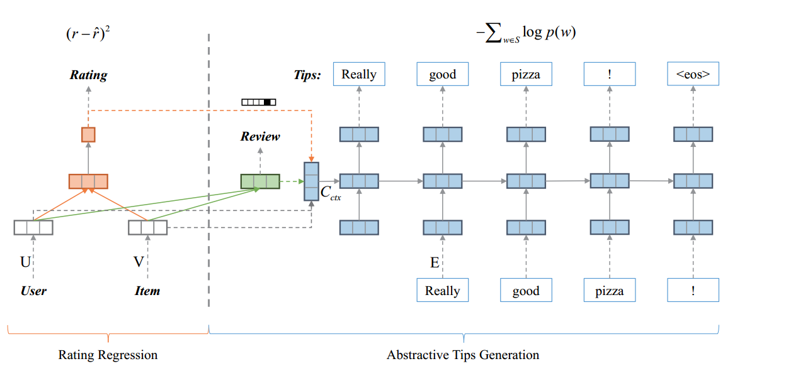

2018Automatic Generation of Natural Language Explanations

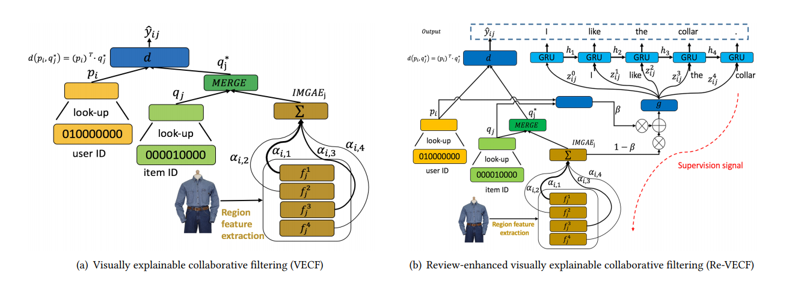

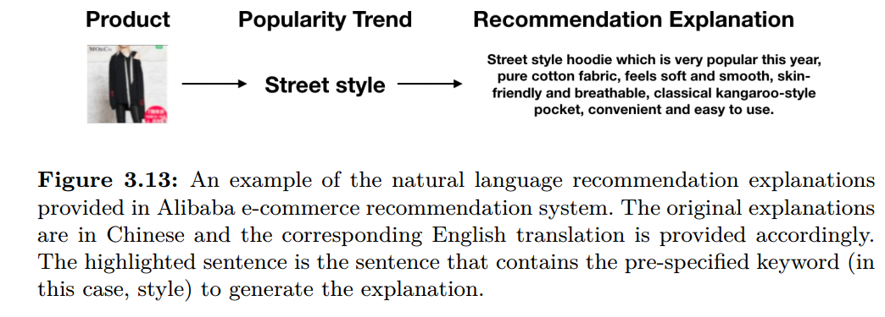

__Knowledge\-base__  __=path comlpetion__

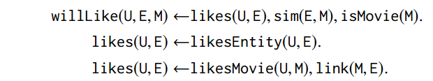

2019Unifying Knowledge Graph Learning and Recommendation: Towards a Better Understanding of User Preferences

__Knowledge\-base__

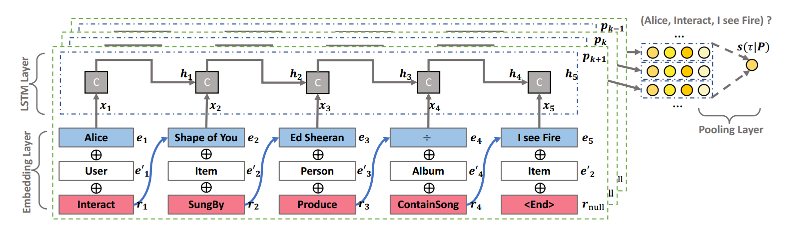

AAAI2019Unifying Knowledge Graph Learning and Recommendation: Towards a Better Understanding of User Preferences

__Knowledge\-base__

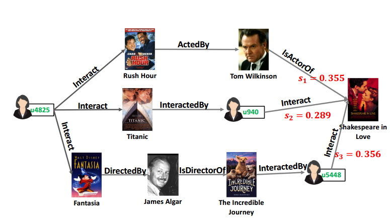

AAAI2019Unifying Knowledge Graph Learning and Recommendation: Towards a Better Understanding of User Preferences

__Knowledge\-base__

TransE

TransH

It assumes that each relation

owns a hyperplane\, and the translation between head entity and

tail entity is valid only if they are projected to the same hyperplane

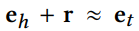

WWW2019Unifying Knowledge Graph Learning and Recommendation:Towards a Better Understanding of User Preferences

__Knowledge\-base__

TransH

WWW2019Unifying Knowledge Graph Learning and Recommendation:Towards a Better Understanding of User Preferences

__Evaluation\-RS__

reli = 1 if the i\-th element is a positive item

__Evaluation__  __\-Explainable__

explainability

EP:explainability precision

ER:explainabilityrecall

Text:

BLUE: 不同长度的统计值差异计算

Rough(Recall\-Oriented Understudy for Gisting Evaluation)

LCSLongest Child String

Open Question

DL explainability

Heterogenous Information Modeling

Text/Image/Audio Search

Natural Language Generation for Explanation

QA System

Explanation beyond Persuasiveness

letting the user know why not to buy a certain product

the system can help to save time for the users and to win user’s trustin the system

Open Question

Aggregation of Different Explanations

__Explainable ML__

__Explainable__  __D__  __L__

Understanding Black\-box Predictions via Influence Functions

