# Behavior Sequence Transformer for E-commerce Recommendation in Alibaba
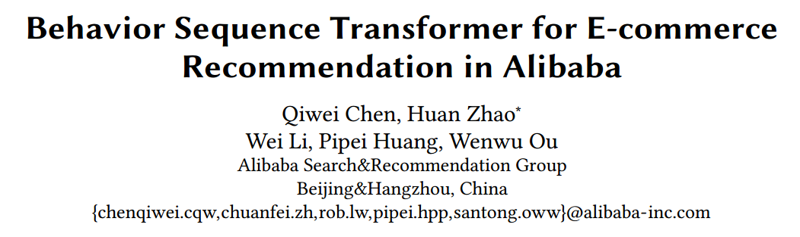

---

# Abstract
- **Embedding&MLP paradigm**: raw features are embedded into lowdimensional vectors
  -  ignoring the sequential nature of users’ behaviors
-  **Transformer model** to capture the sequential signals underlying users’ behavior sequences for recommendation 

---

# Transforemer(Attention is all you need)
## Architecture
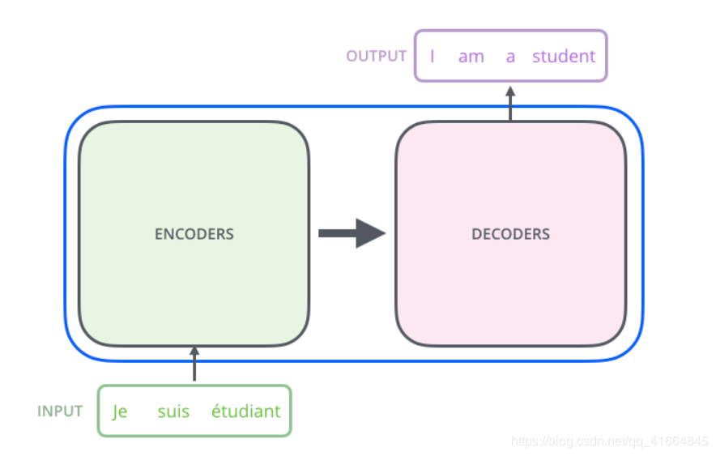

---

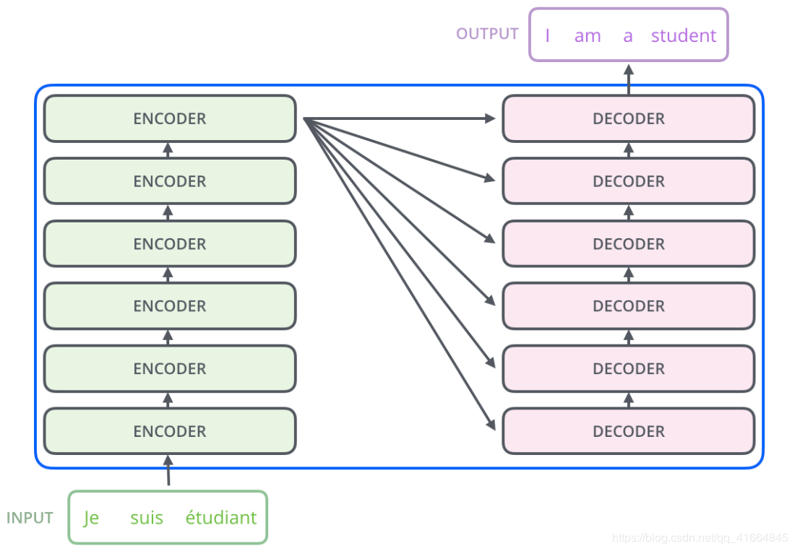

---

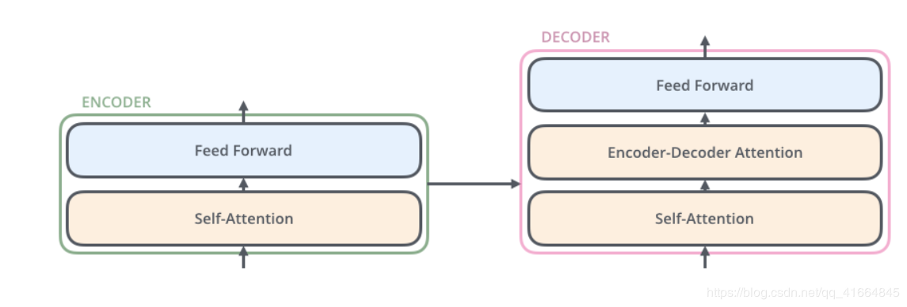

Every encoder do not share their weights

---

## Self-Attention Encoder
Input Word->Embededing
$$ q_1=V*W_q $$
$$ k_1=V*W_k $$
$$ v_1=V*W_v $$

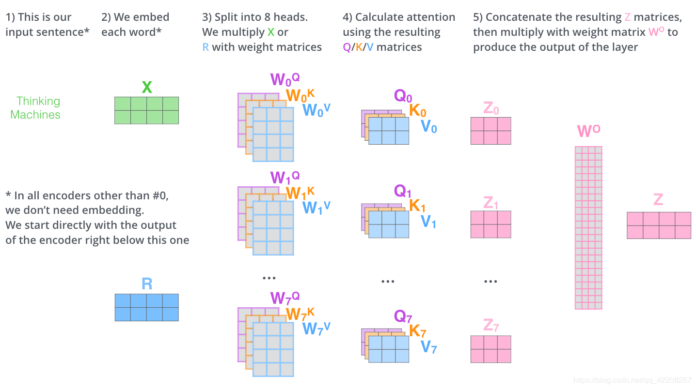

---

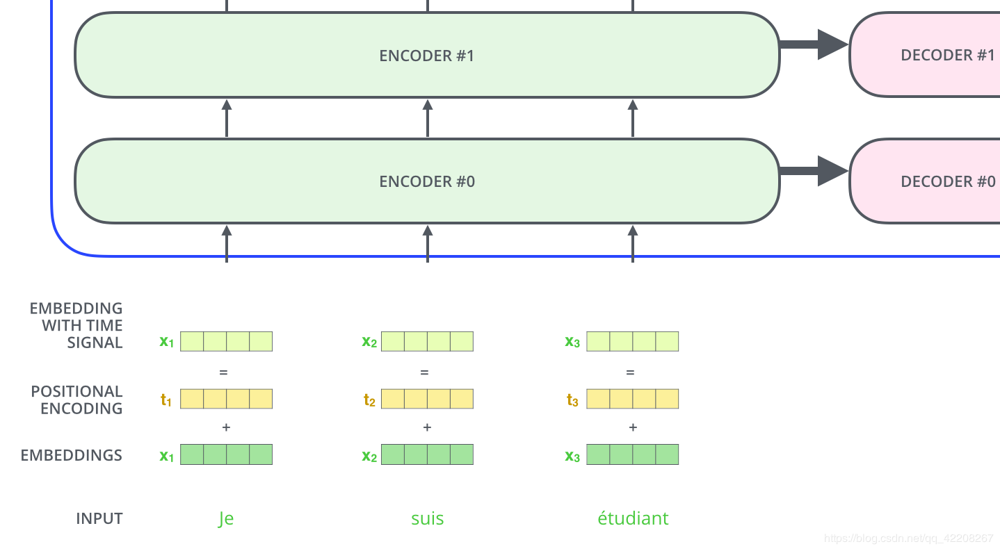

---

**Position**: diffierent distance to different pos 

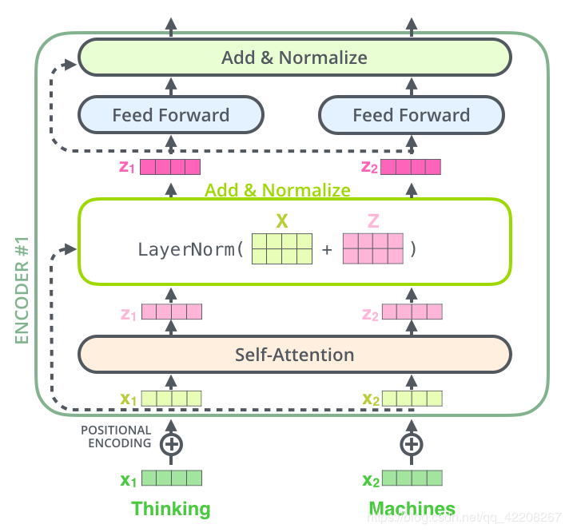

---

## Decoder
The Unis number is O(Word)  
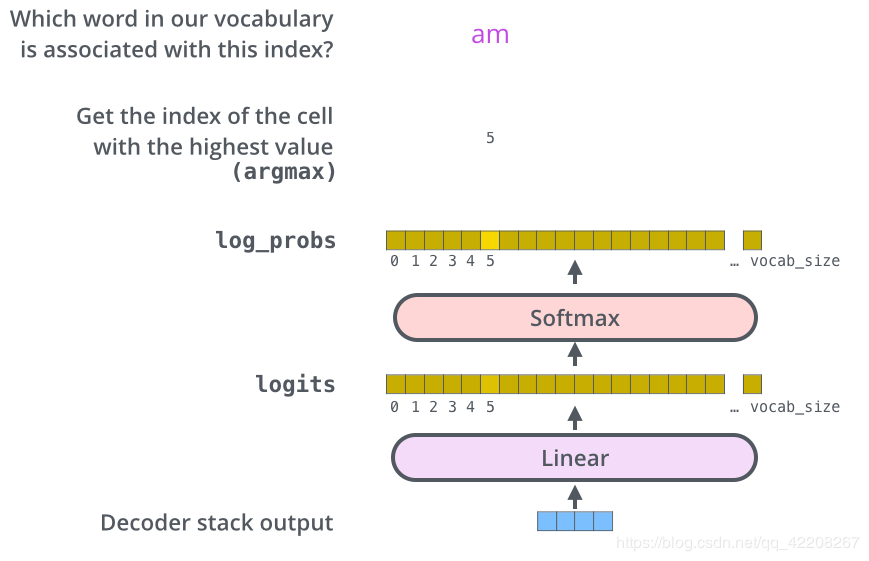  

---

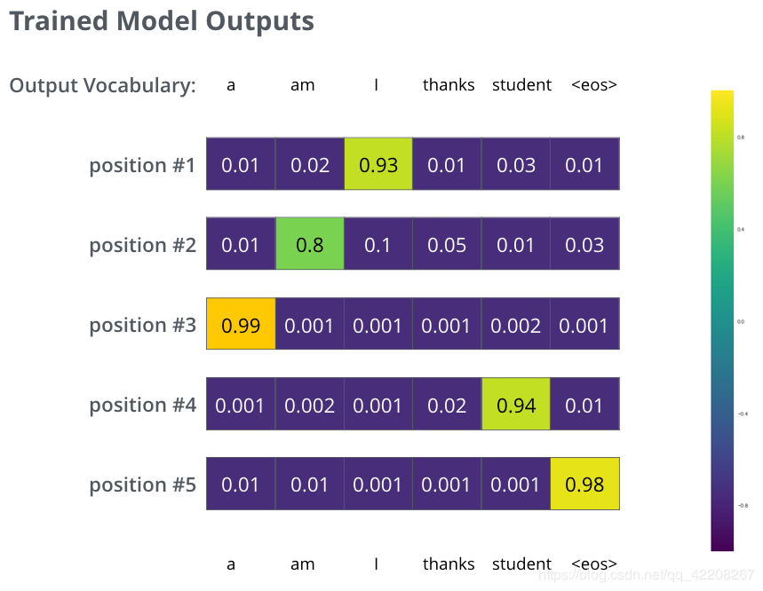    

---

## loss  
The differience of 2 distribution
- Cross Entropy
- KL Distance
  

---

# BST

## Architecture
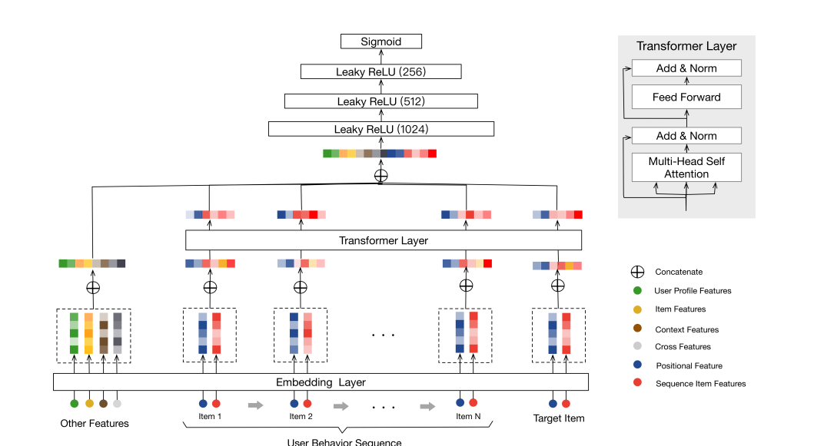

---

## Feature
### General Embedding
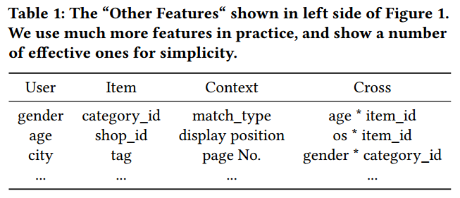

---

### Positional embedding
$$pos(v_i) = t(v_t) − t(v_i)$$

where $t(v_t)$ represents the recommending time and $t(v_i)$ the timestamp when user click item $v_i$.

---

## Transformer
### Self-attention layer  
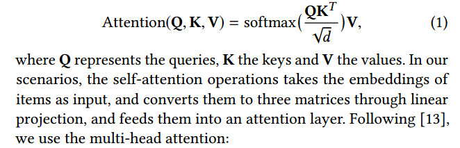

---

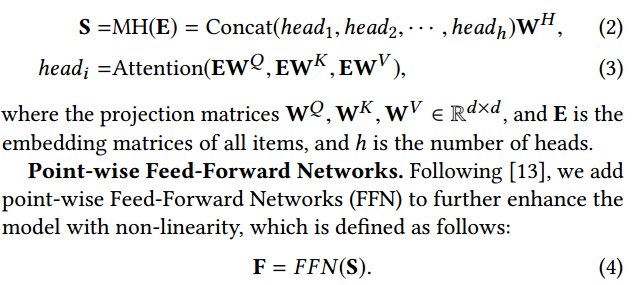

---

### Point-wise Feed-Forward Networks
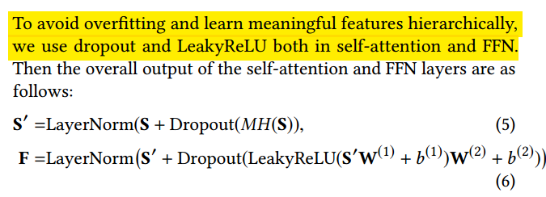

---

## MLP layers and Loss function
**binary classification problem**   
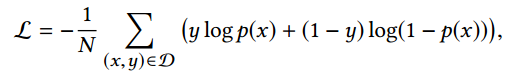  

---

# Result
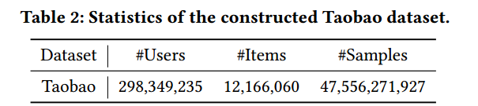
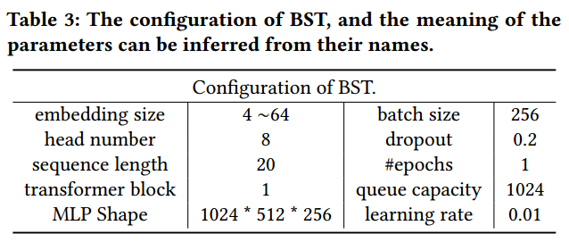

---

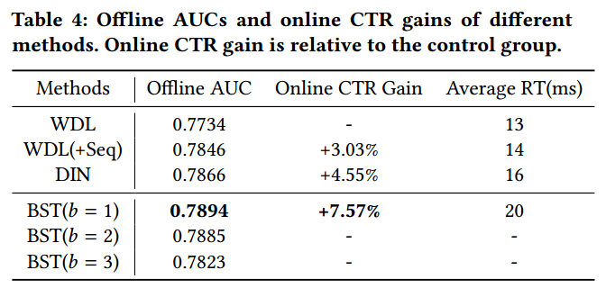

